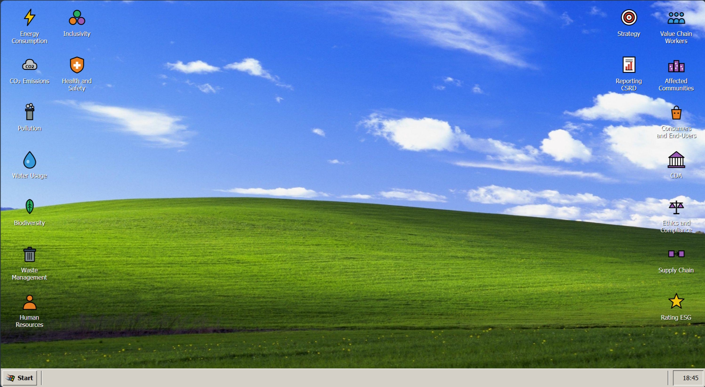
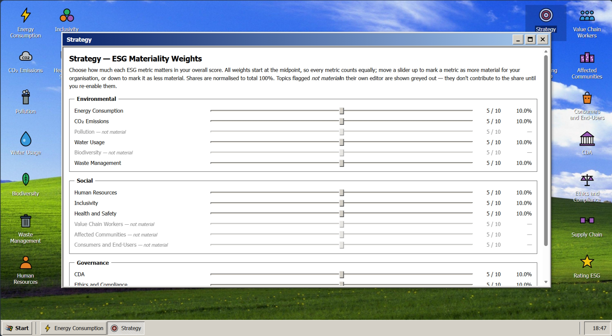
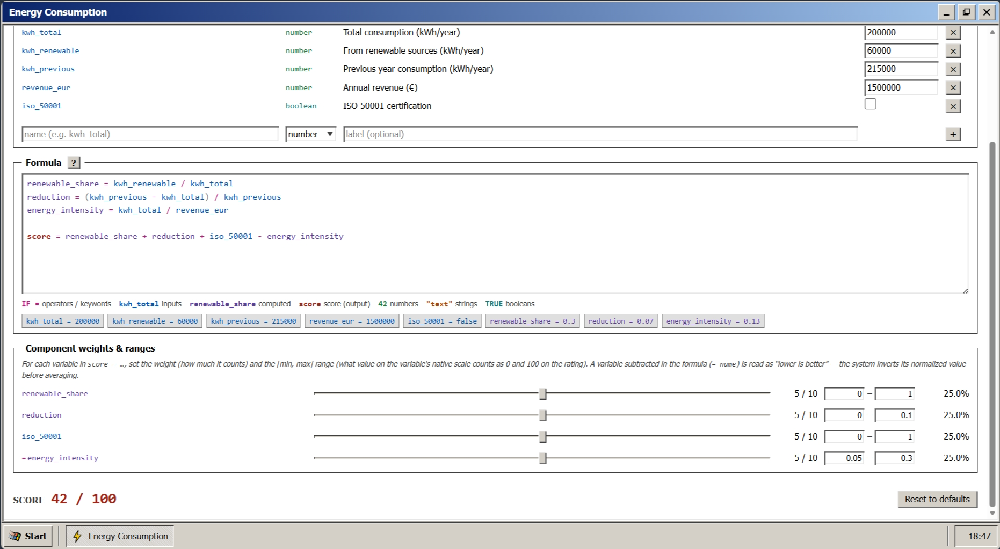
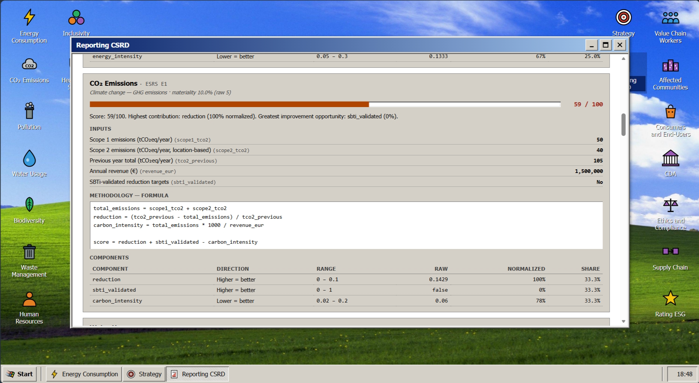

# Sostenibilità

[](https://github.com/WhileX1/Sostenibilita/actions/workflows/ci.yml)
[](./LICENSE)
[](https://sostenibilita.vercel.app)

Progetto scolastico — autovalutazione ESG per PMI italiane in stile **Windows 2000**.

🌐 **Demo live**: [sostenibilita.vercel.app](https://sostenibilita.vercel.app)

L'utente compila 15 indicatori ESRS (E1–E5, S1–S4, G1), modifica le formule con un piccolo DSL custom, ottiene un rating ESG 0–100 e stampa la dichiarazione di sostenibilità in formato CSRD.

> Non sostituisce una dichiarazione CSRD ufficiale ai sensi della Direttiva (UE) 2022/2464.



## Cosa c'è dentro

- **15 metriche ESG** seedate per una PMI italiana di manifattura leggera (~50 dipendenti, ~1,5 M€), ognuna ancorata al corrispondente standard ESRS e, dove rilevante, al diritto italiano (D.Lgs. 231/2001, D.Lgs. 24/2023, D.Lgs. 81/08, Legge Golfo-Mosca, Codice Autodisciplina).
- **Editor di metrica** con formula in DSL, slider di peso e range di giudizio per ogni componente.
- **Strategy** per la materialità cross-metrica: uno slider 0–10 per indicatore, con quote normalizzate live.
- **Rating ESG** aggregato (overall + sotto-score Environmental / Social / Governance) e **Reporting CSRD** stampabile in PDF.
- **Materiality switch** per metrica: chi non valuta un'area deve dichiararne il motivo.
- **Shell Win2K**: desktop con icone, taskbar, Start menu, finestre, persistenza in `localStorage`.

## I pezzi tecnici interessanti

Le tre cose costruite da zero che probabilmente meritano un'occhiata:

### 1. DSL della formula — parser/evaluator scritti a mano

Tokenizer → parser a discesa ricorsiva con precedence climbing → evaluator tree-walking. Niente `eval()`, niente librerie: 7 livelli di precedenza, 7 funzioni built-in, IF/ELSE, regola "calcolatrice" sul percento (`100 + 10%` = `110`, non `100.1`), errori con riga/colonna che la UI mostra inline. 52 smoke test coprono casi happy + errori. L'estrattore delle componenti dello score ha un fallback a tre livelli (compile completo → parse della sola riga `score = …` → regex) per non far sparire gli slider mentre l'utente sta ancora digitando.

→ [`web/lib/formula/`](./web/lib/formula/) · [docs](./web/docs/architecture/formula-dsl.md)

### 2. Modello di scoring a tre livelli

Componenti (definite dal DSL) → materialità (cross-metrica, slider 0–10) → ESG aggregato. Ogni componente porta con sé direzione (segno `+`/`−` nella formula = higher-is-better / lower-is-better) e range `[min, max]` di giudizio normalizzato a 0–100, indipendente dalla scala nativa della variabile (frazione, kWh/€, booleano). Le quote di materialità sono normalizzate live: spostando uno slider, le altre percentuali si aggiornano in tempo reale.

→ [`web/lib/scoring/`](./web/lib/scoring/) · [docs](./web/docs/architecture/scoring.md)



### 3. Shell Win2K a finestra singola

Window manager Redux con un solo "foreground" in DOM alla volta (le altre finestre vivono solo come bottone sulla taskbar — costo zero), routing deep-link bidirezionale, snap-to-grid del desktop con celle ancorate ai bordi (icone che restano sui lati anche se il viewport si restringe), tema completamente data-driven (zero hex literals nei componenti, tutto centralizzato in `lib/themes/`), persistenza in `localStorage` con gate di idratazione per evitare flash al primo paint.

→ [`web/components/layout/`](./web/components/layout/) · [docs shell](./web/docs/architecture/shell.md) · [window manager](./web/docs/architecture/window-manager.md)



## Stack

Next.js 16 (App Router) + React 19 + TypeScript, Redux Toolkit, Tailwind 4, parser/evaluator DSL scritto a mano (zero dipendenze runtime esterne per la formula).

## Avvio

L'app vive nella cartella [`web/`](./web):

```bash
cd web
npm install
npm run dev
```

Apri [http://localhost:3000](http://localhost:3000).



## Documentazione

- [`web/README.md`](./web/README.md) — quick start, comandi, struttura della repo.
- [`web/docs/`](./web/docs) — documentazione tecnica: architettura della shell, window manager, DSL della formula, modello di scoring, sistema di temi.
